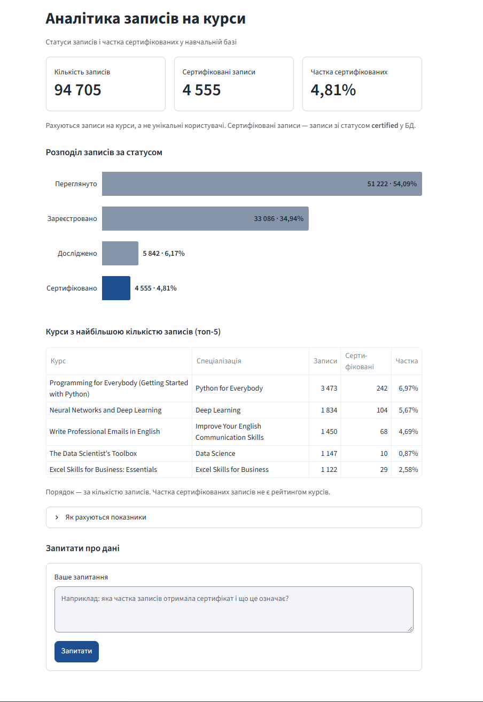

# Аналітика записів на курси

Застосунок показує, скільки разів користувачі записувалися на курси, які статуси мають ці записи та які курси мають найбільше записів. Дані зберігаються в PostgreSQL.

## Що показує застосунок



На скриншоті показано локально запущений застосунок. База даних і ключ Gemini API
не входять до репозиторію, тому для запуску знадобляться власні дані для підключення.

- **Показники:** загальна кількість записів на курси, кількість записів зі статусом
  `certified` і їхня частка. Це записи, а не унікальні люди: одна людина може мати
  кілька записів на різні курси.
- **Діаграма:** показує, скільки записів мають статуси «Переглянуто», «Зареєстровано»,
  «Досліджено» та «Сертифіковано». Поруч із кількістю наведено частку від усіх записів.
  Це розподіл за статусами, а не послідовні етапи навчання.
- **Топ-5 курсів:** таблиця з назвами курсів, спеціалізаціями, кількістю записів
  і часткою записів зі статусом `certified`. Курси впорядковано за кількістю записів;
  частка сертифікованих не є рейтингом якості курсів.
- **Запитання до агента:** користувач може попросити пояснити показники українською.
  Докладні правила підрахунку можна відкрити в блоці «Як рахуються показники».

## Як влаштовано

У репозиторії є такі файли:

| Файл | Призначення |
|---|---|
| `app.py` | інтерфейс Streamlit |
| `db.py` | отримує дані з бази та рахує показники |
| `agent.py` | задає правила відповіді агента Gemini та доступні йому дані |
| `.streamlit/config.toml` | налаштування вигляду сторінки й показу помилок |
| `requirements.txt` | бібліотеки, потрібні для запуску |
| `.env.example` | шаблон налаштувань підключення без паролів і ключів |
| `.gitignore` | виключає з Git локальний `.env` і тимчасові файли |
| `docs/dashboard-overview.png` | скриншот сторінки, показаний вище |
| `README.md` | опис проєкту та інструкція запуску |

Коли користувач відкриває сторінку, `db.py` читає дані з бази й рахує числа для
показників, діаграми та таблиці. Застосунок не змінює записи в базі.

Коли користувач ставить запитання, агент може звернутися до чотирьох підготовлених
наборів даних: загальних показників, розподілу статусів, перевірок якості даних
і топ-5 курсів. Gemini отримує ці підсумки та формулює відповідь українською.
Агент не має доступу до всієї бази: наприклад, він не зможе назвати кількість
записів для довільного курсу поза топ-5. Персональні та платіжні дані йому
не передаються.

## Як запустити локально (Windows, PowerShell)

Потрібні Python, дані для підключення до бази PostgreSQL і власний ключ Gemini API.
Бази даних і облікових даних **немає** в репозиторії. Усі команди нижче виконуйте
в терміналі з кореня проєкту — папки, де лежить `app.py`.

1. Після завантаження проєкту створіть локальне віртуальне середовище та встановіть залежності:

   ```powershell
   python -m venv .venv
   .\.venv\Scripts\python.exe -m pip install -r requirements.txt
   ```

2. Створіть власний файл налаштувань із шаблону:

   ```powershell
   Copy-Item .env.example .env
   ```

   Відкрийте `.env` у редакторі та впишіть **свої** значення після `=`:

   | Змінна | Значення |
   |---|---|
   | `PGHOST`, `PGPORT`, `PGDATABASE` | адреса сервера, порт і назва бази даних |
   | `PGUSER`, `PGPASSWORD` | облікові дані бази (бажано користувач лише з правом читання) |
   | `PGSSLMODE` | за потреби розкоментуйте рядок у шаблоні та вкажіть режим SSL, який вимагає сервер |
   | `GEMINI_API_KEY` | ваш ключ Gemini API |
   | `GEMINI_MODEL` | доступна вашому ключу модель; у шаблоні вказано `gemini-3.8-flash` |

   У шаблоні лише `PGPORT` і `GEMINI_MODEL` мають прикладові значення; усі
   облікові дані залишено порожніми. Файл `.env` з реальними значеннями не
   надсилайте іншим і не додавайте до Git.

3. Запустіть сторінку разом з агентом:

   ```powershell
   .\.venv\Scripts\python.exe -m streamlit run app.py
   ```

   Відкрийте локальну адресу, яку покаже Streamlit у терміналі. Показники, діаграма
   й таблиця завантажуються з бази. Щоб звернутися до агента, введіть запитання
   у полі «Ваше запитання» й натисніть «Запитати». Окремо запускати `agent.py`
   не потрібно. Наприклад, запитайте: «Які курси мають найбільше записів?».
   Якщо вичерпано квоту Gemini, сторінка з даними залишається доступною, але
   агент не зможе відповісти до відновлення квоти.

4. Щоб зупинити застосунок, натисніть `Ctrl+C` у терміналі Streamlit.

Застосунок очікує в базі таблиці `enrollments` і `dim_course` з полями, які
використовує `db.py`. Якщо у вашій базі інша структура, однієї заміни `.env`
недостатньо: потрібно також змінити запити в `db.py`.

## Звідки застосунок бере дані

Під час роботи застосунок читає дані з бази PostgreSQL, зазначеної в локальному
файлі `.env`. MCP-інструмент `course-db` допомагав переглянути структуру бази
під час розробки. Для запуску готового застосунку MCP не потрібен.

## Безпека

- `.env` у `.gitignore` і не публікується; у репозиторії лише `.env.example` без облікових даних і ключів.
- Паролі, ключі та рядки підключення не виводяться в інтерфейс.
